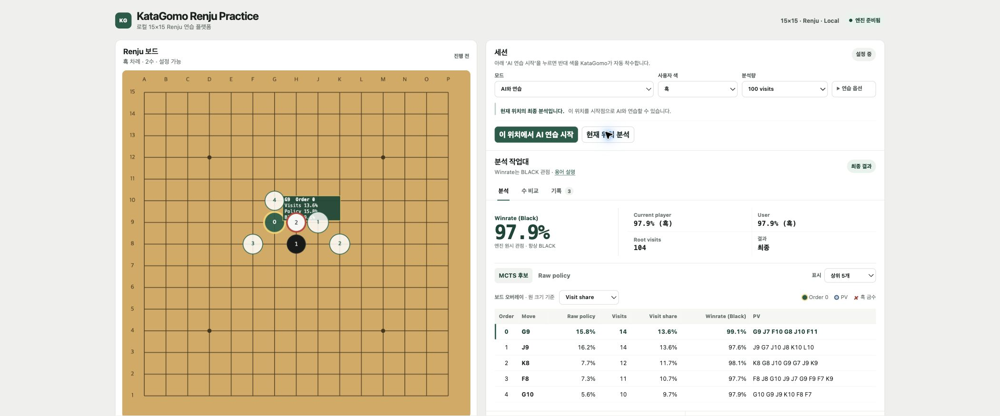

# KataGomo Renju Practice

[](https://github.com/famegon/katagomo-renju-practice/actions/workflows/ci.yml)

KataGomo Renju Practice is a **local macOS desktop web app** for exploring
15×15 Renju positions with the official KataGomo engine and Renju model. It
shows raw policy, MCTS visits, Black winrate, and PVs; supports AI practice or
placing both colors manually; and uses KataGomo's C++ rules code for forbidden
moves and terminal positions.

The board can also import the single supported 15×15 Renju JSON format. Use
[`examples/renju-kifu.json`](examples/renju-kifu.json) as a template. Files are
read locally in the browser, validated by the official KataGomo position
helper, and then opened in free-analysis mode for undo or MCTS analysis.

This is not a hosted service. Publishing the repository does not make it run on
GitHub Pages: every user must build the native engine and run the Python server
on their own Mac at `127.0.0.1`.



_A real CPU/Eigen analysis of `B H8, W H9` with the official model, not mock data._

## Support scope

- Verified: Apple Silicon M5 on macOS
- Experimental and not hardware-tested: Intel Mac
- Not supported: mobile UI, Windows/Linux, LAN or public-server deployment
- Python: an existing stable CPython 3.11 or newer; setup creates `.venv` and
  does not install a new Python version
- Node.js 18+ is needed only for contributor tests, not normal use

## Install and run

```bash
git clone https://github.com/famegon/katagomo-renju-practice.git
cd katagomo-renju-practice
python3 --version
make doctor
make bootstrap
make dev
```

Open <http://127.0.0.1:8000>. The first setup builds the CPU/Eigen engine and
downloads the 269,873,929-byte model from the official KataGomo release.

For AI practice, choose Black or White and then click **이 위치에서 AI 연습 시작**.
If you choose Black, you play first and the AI responds. If you choose White,
the AI analyzes and plays Black first. A
100-visit CPU search took about five seconds on the verified M5 and may be
slower elsewhere.

## Tests

```bash
make release-check
make test
make integration-test
```

`make test` includes the release-tree guard. The latest recorded regression
passed 88 web tests, 202 Python unit tests, and
2 real-engine integration tests. The integration tests use the actual official
model rather than mock analysis.

## Licensing and model

The original files in this repository are MIT licensed. The KataGomo checkout,
compiled binaries, neural-network model, build output, and logs are not
committed or redistributed. `make model` downloads the model directly from the
official release and verifies its recorded size, gzip stream, and SHA-256.
See [Third-party notices](THIRD_PARTY_NOTICES.md) before use or redistribution.
This is an unofficial project and is not affiliated with or endorsed by
KataGomo, KataGo, or the model authors.

The complete Korean README contains usage details, troubleshooting,
benchmarks, protocol contracts, and reproducibility evidence: [README.md](README.md).
